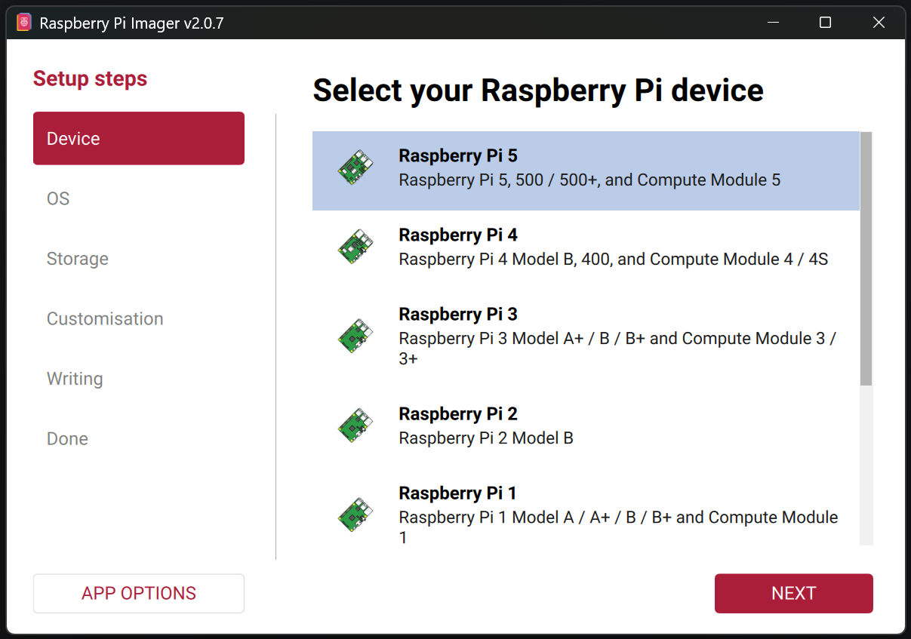
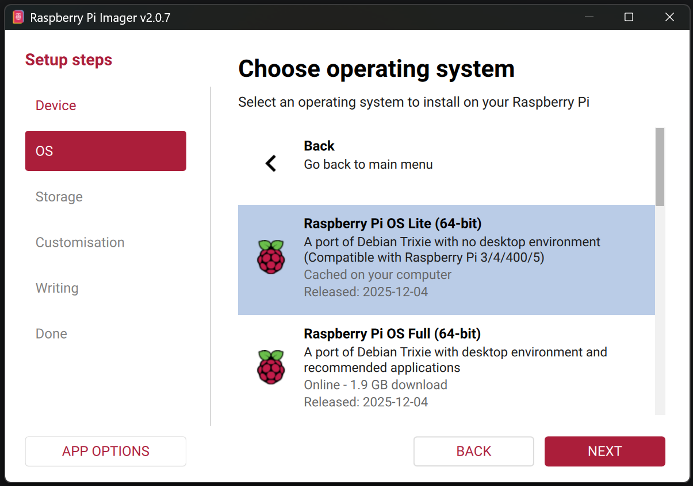
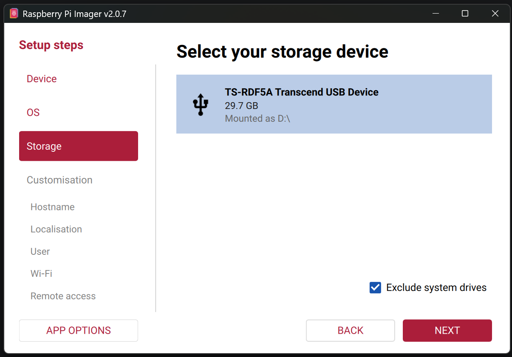
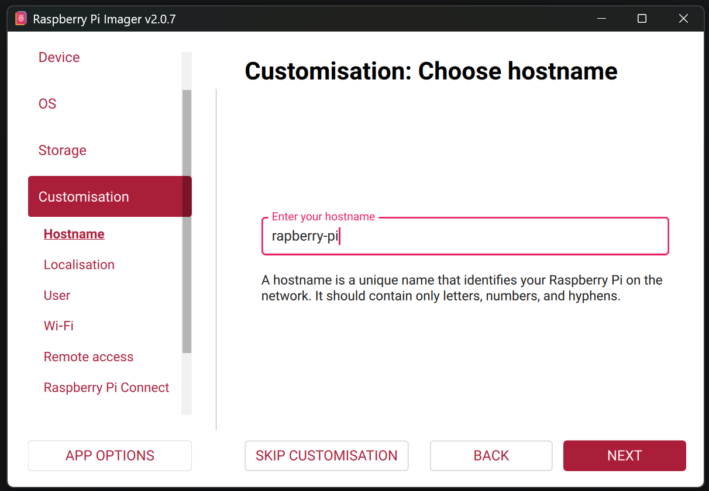
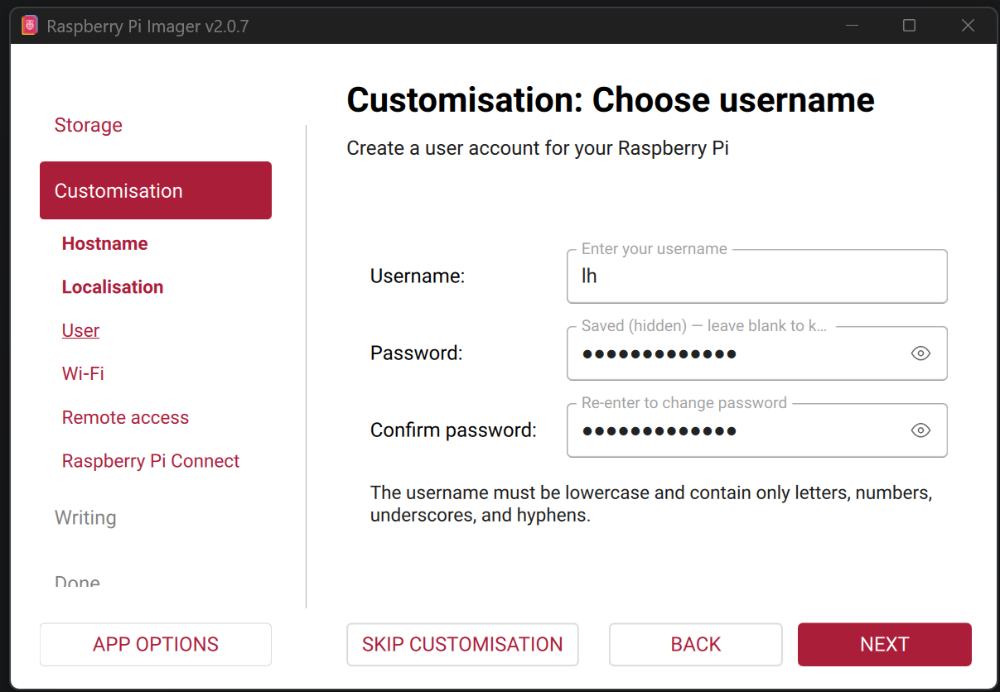
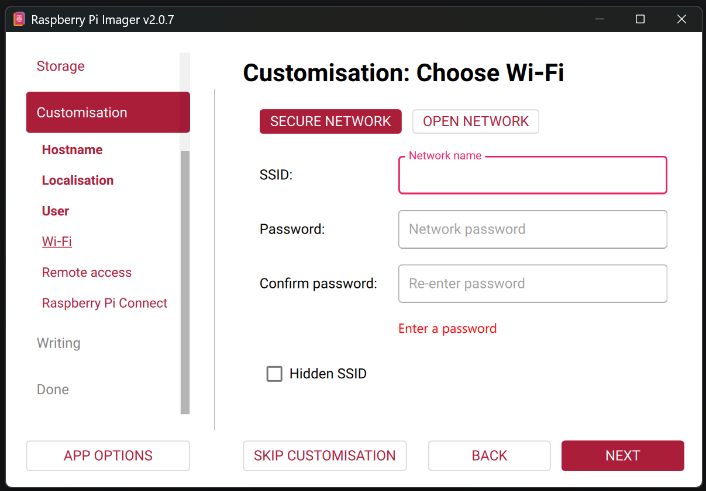
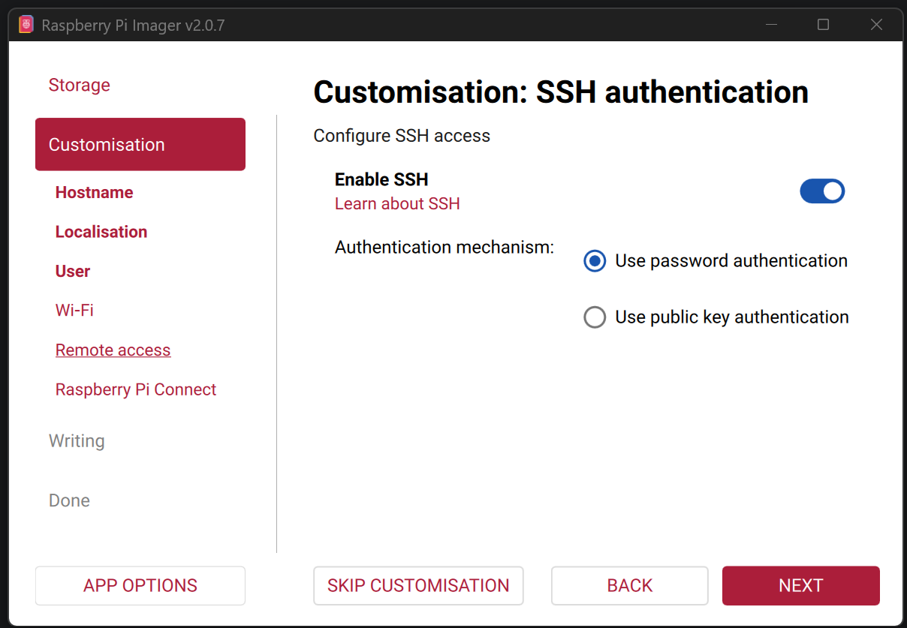

# Raspberry Pi OS Install

> By the end of this section, you will have a Raspberry Pi SD card prepared with Raspberry Pi OS Lite, SSH enabled, and the base host/user settings in place for the rest of the guide.

---

## At a Glance

| Item | Value |
| --- | --- |
| Goal | Prepare a headless Raspberry Pi OS image for the motion controller |
| Estimated time | 15 to 20 minutes, plus imaging time |
| You finish with | A bootable Pi SD card with SSH enabled and user credentials configured |

---

## Before You Start

You will need:

- a Raspberry Pi 5
- a microSD card and card reader
- the controller PC that will be used to prepare the card
- [Raspberry Pi Imager](https://www.raspberrypi.com/software/) installed on that PC

Recommended settings used throughout this guide:

| Setting | Recommended Value |
| --- | --- |
| Device | `Raspberry Pi 5` |
| OS | `Raspberry Pi OS Lite (64-bit)` |
| Hostname | `raspberry-pi` |
| Username | `lh` |
| Wi-Fi | leave unconfigured |
| SSH | enabled |

> If you choose different values, keep a note of them now. You will need to substitute them in later chapters.

---

## Why Raspberry Pi OS Lite

This guide uses **Raspberry Pi OS Lite (64-bit)** rather than the desktop image because it avoids the extra background processes and GUI overhead that are unnecessary for a dedicated motion controller.

For this project that matters because:

- lower background CPU load helps reduce scheduling noise
- headless operation is simpler for a permanently embedded controller
- the Pi will be administered over SSH rather than with a monitor and keyboard

---

## Step 1 - Select the Device

Open Raspberry Pi Imager and choose the target board.

1. Click **Choose Device**
2. Select **Raspberry Pi 5**

---

## Step 2 - Select the Operating System

Choose the lightweight operating system image.

1. Click **Choose OS**
2. Select **Raspberry Pi OS Lite (64-bit)**
3. If you do not see it immediately, look under **Raspberry Pi OS (other)**

> Avoid the desktop image unless you have a specific need for it. The Lite image is the better fit for a headless controller.

---

## Step 3 - Select the Storage Device

Choose the microSD card that will be written.

1. Insert the microSD card into the controller PC
2. Click **Choose Storage**
3. Select the correct removable drive

> Double-check the selected drive before writing. Raspberry Pi Imager will erase it.

---

## Step 4 - Open the Customisation Settings

Before writing the card, open the customisation settings so the Pi is ready for headless access on first boot.

Set:

- hostname to `raspberry-pi`
- username to `lh`
- a password of your choice

> Do not leave the password blank. SSH access is much easier to debug later if the initial user account is valid from the start.

---

## Step 5 - Leave Wi-Fi Disabled and Enable SSH

This build is designed to run over Ethernet rather than Wi-Fi, so leave wireless networking unconfigured.

In the same customisation dialog:

1. Leave **Wi-Fi** unset
2. Open the **Services** or **Remote Access** pane
3. Enable **SSH**

Why this matters:

- the final system uses direct Ethernet only
- avoiding Wi-Fi reduces background network activity
- SSH gives you immediate remote access on first boot

---

## Step 6 - Write the SD Card

Finish the imaging process.

1. Click **Next**
2. Confirm the customisation settings
3. Click **Yes** to write the card
4. Wait for flashing and verification to complete

When Raspberry Pi Imager finishes:

1. remove the microSD card safely
2. insert it into the Raspberry Pi
3. connect Ethernet between the Pi and the controller PC
4. power on the Pi
5. wait about 30 to 60 seconds for the first boot

---

## Check Your Work

At this point you should have:

- a bootable Raspberry Pi OS Lite SD card
- SSH enabled
- the initial host and user settings configured
- the Pi powered on and connected to the controller PC by Ethernet

You do **not** need to log in yet. That happens in the next chapter once temporary internet sharing is enabled.

---

## Next Step

Continue to [Raspberry Pi Networking](02-networking.md).

---

## Navigation

- Index: [Klipper Setup Guide](../index.md)
- Next: [Raspberry Pi Networking](02-networking.md)
