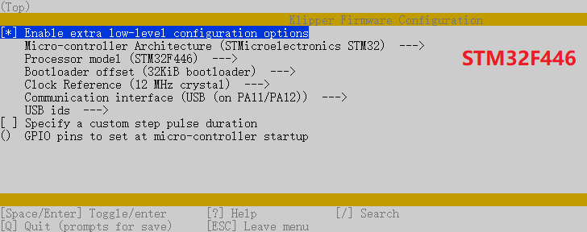
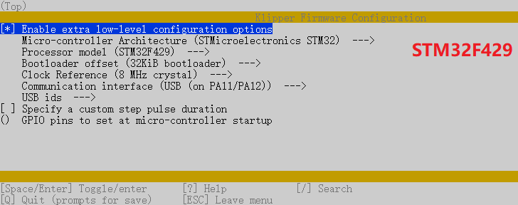
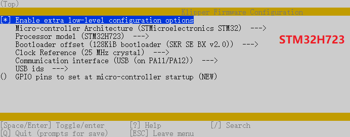
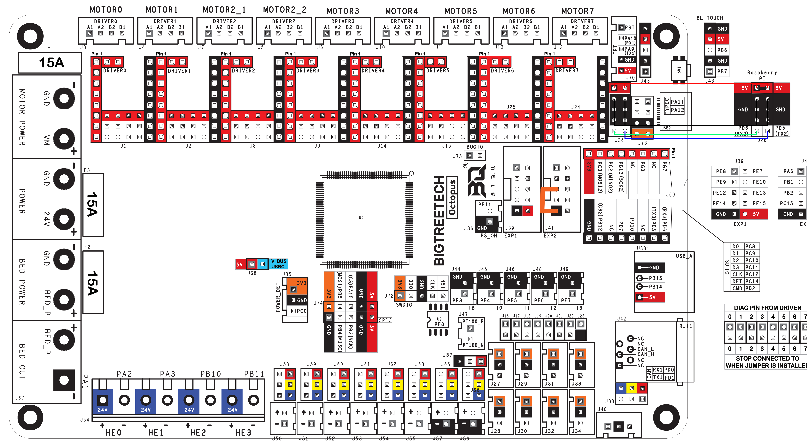

# Klipper Firmware Flashing

> This section details how to flash the Klipper firmware to the Octopus board

Klipper runs in two places:

- the Raspberry Pi runs the high-level Klipper host software
- the Octopus runs the Klipper MCU firmware

This chapter covers the Octopus side. 
You will build a firmware image on the Pi, then flash it to the board either through **USB DFU mode** or 
by copying `firmware.bin` to a microSD card.

---

## Prerequisite

- [Install Packages](03-packages.md) is complete
- Pi can be reached over SSH
- Host PC has SSH File Transfer Protocol (STFP) software (*e.g. WinSCP/FileZilla/MobaXterm*) 

It is also important to know which MCU your Octopus board actually has as this will determine the Bootloader and clock selection.
Selecting the wrong MCU settings will produce a firmware image that does not boot correctly.
This can be found on the suppliers website and on the device itself. 
Common variants include: `STM32F446`, `STM32F429`, `STM32H723`
Even if you intend to power the Pi from the Octopus, during this flashing process it is more convenient to power the Pi from the regular USB power supply.
---

## Step 1 - Build the Firmware Image

SSH into the Pi and prepare the Klipper build directory:

```bash
sudo apt install make -y
cd ~/klipper
make clean
make menuconfig
```

In `make menuconfig`, select the settings that match your board:

- Select “Enable extra low-level configuration options”
- Set the micro-controller architecture is set to `STMicroelectronics STM32`
- Set the Processor model to `STM32F446`,`STM32F429` or `STM32H723` (Depends on the MCU of your motherboard)
- Set the Bootloader offset to `32KiB bootloader` (for `STM32F446`, `STM32F429`) or `128KiB bootloader` (for `STM32H723`)
- Set the Clock Reference to `12 MHz crystal` (for `STM32F446`), `8 MHz crystal` (for `STM32F429`), `25MHz crystal` (for `STM32H723`)
- Set the Communication interface to `USB (on PA11/PA12)` (note: see [BigTreeTech documentation](https://github.com/bigtreetech/BIGTREETECH-OCTOPUS-V1.0/tree/master/Octopus%20works%20on%20Voron%20v2.4/Firmware/Klipper) if you intend to use UART rather than USB)


**STM32F446**



**STM32F429**



**STM32H723**



When the configuration is correct:

1. Press `Q` to exit
2. Choose **Yes** when asked to save
3. Build the firmware using:
```bash
make -j4
```

Once the build completes, the generated `klipper.bin` file will be found in the `~/klipper/out/` directory.

---

## Step 2 - Choose a Flashing Method

There are two standard ways to install the firmware on the Octopus:

- **USB DFU mode**
  Best when the board is already connected to the Pi over USB and you are comfortable setting the boot jumpers.
- **microSD card**
  Usually the simplest and least error-prone method if you have a spare card available.

Use whichever route is more convenient for your build.

---

## Option A - Flash Over USB Using DFU Mode
> - Requires a USB connection
> - Requires the installation of an extra jumper on the Octopus
> - Does NOT require a sd card

### Procedure

1. Power off the Octopus
2. Install the `BOOT0` jumper
3. Install a jumper between `GND` and `PB2` (*see orange bar on pinout below*)
4. Connect Octopus & Pi via USB-C 
5. Power on the Octopus
6. Press the reset button next to the USB connector
7. From your ssh session, run `cd ~/klipper` to make sure you are in the correct directory.
8. Confirm the board appears in DFU mode by running `lsusb` in the terminal. A device named `STM Device in DFU Mode` should be visible.
9. Flash the firmware using the detected device ID:

```bash
make flash FLASH_DEVICE=1234:5678
```

Where `1234:5678` is replaced with the USB ID reported by `lsusb`.

10. Power off the Octopus
11. Remove the `BOOT0` and `BOOT1` jumpers
12. Power on the Octopus again
13. Check that the flashed board now appears as a Klipper serial device:

```bash
ls /dev/serial/by-id/
```

Expected output will look similar to:

```text
usb-Klipper_stm32f446xx_XXXXXXXX-if00
```

### Why the BOOT1 Jumper Matters

Entering the correct boot mode on STM32 chips like those that power the octopus board, depends on both `BOOT0` and `BOOT1` settings. [*REF*](https://deepbluembedded.com/stm32-boot-modes-stm32-boot0-boot1-pins/)  
For **DFU** mode (*system memory*):
- `BOOT0` must be high
- `BOOT1` must be low

On the Octopus, the STM32 `BOOT1` line is also wired with `PB2` pin in the `EXP2` junction , which is floating by default.
Pulling `PB2` to `GND` (orange link in pinout) ensures the MCU enters the correct boot mode for DFU flashing instead of landing in an invalid state.
If not pulled low, the octopus *may* boot into the empty embedded SRAM, making the board appear dead. 

Reference pinout:



---

## Option B - Flash Using a microSD Card

### When to Use This Method

Use the SD-card method if:

- you have a spare microSD card available
- you want a simple manual flashing workflow
- USB DFU mode is inconvenient or unavailable

### Procedure

1. On the Pi, create the exact filename expected by the bootloader:

```bash
cd ~/klipper
cp out/klipper.bin out/firmware.bin
```

2. Copy `~/klipper/out/firmware.bin` from the Pi to your controller PC
3. Format the microSD card as **FAT32**
4. Copy `firmware.bin` to the root of that card
5. Power off the Octopus
6. Insert the microSD card into the Octopus
7. Power the Octopus back on
8. Wait a few seconds for the bootloader to flash the image
9. Reconnect to the Pi and check for the Klipper serial device:

```bash
ls /dev/serial/by-id/
```

Again, you are looking for something similar to:

```text
usb-Klipper_stm32f446xx_XXXXXXXX-if00
```

> The file must be named `firmware.bin`. If the name is wrong, the bootloader will ignore it.

---

## Check Your Work

This section is complete when:

- the firmware build finished without errors
- the Octopus appears under `/dev/serial/by-id/`
- you know the exact serial path for the board

Keep that serial path. You will need it in `printer.cfg` in the next chapter.

---

## Troubleshooting

If the board does not appear after flashing:

- confirm you built the firmware for the correct MCU
- confirm the board has proper main power, not just USB power
- confirm the communication interface chosen in `menuconfig` matches your intended wiring
- if using DFU, make sure `BOOT0` was removed after flashing

If the board powers up but drivers or peripherals do not respond correctly:

- verify the Octopus is powered from the correct 12 to 24 V supply
- verify the board is not being tested from USB power alone

---

## Next Step

Continue to [Klipper Configuration](05-klipper-config.md).

---

## Navigation

- Previous: [Install Packages](03-packages.md)
- Index: [Klipper Setup Guide](../index.md)
- Next: [Klipper Configuration](05-klipper-config.md)
